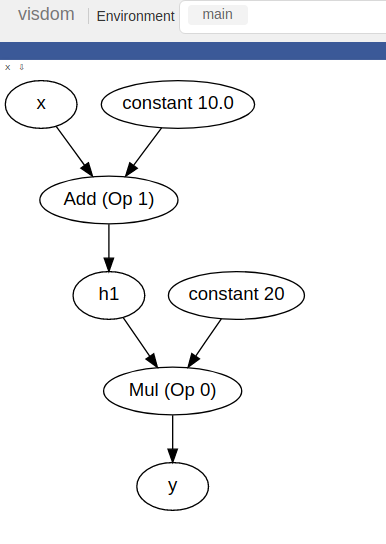

# Repositorio generado de [minitorch/Module-1](https://github.com/minitorch/Module-1)
## MiniTorch Module 1 En Proceso


# Estudiante 
	Walter Jesús Felipe Tolentino
	
# Ejecutar las pruebas
```
python3 run_tests.py
```
# Resultados

## task 1.1 completado
## task 1.2 completado



## task 1.3 completado
## task 1.3 en proceso
